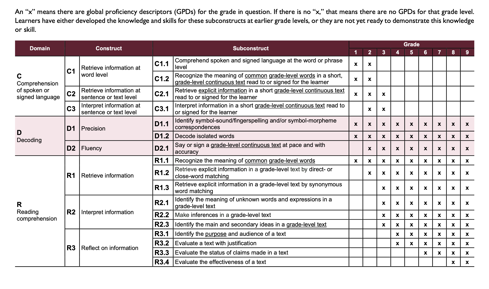
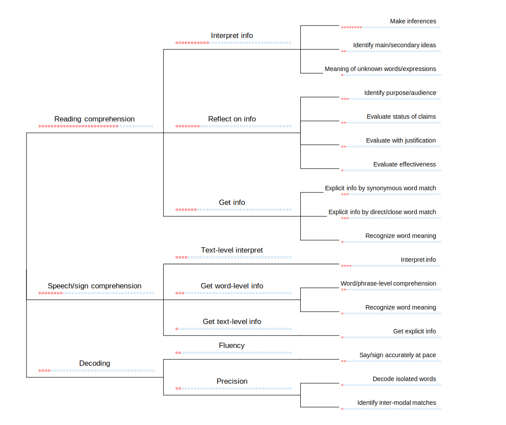

# Digitizing the Global Proficiency Framework

The [Global Proficiency Framework](https://www.edu-links.org/resources/global-proficiency-framework-reading-and-mathematics) describes structured framework of specific skills in foundational literacy and numarcy in reading and mathematics across grades 2 to 9. This is presented in the form of a detailed PDF document outlining the structure of the framework with example assessment items.

This repository contains a digitized version of the GPF for Reading, including the example assessment items, to support and enable development of computational tools based on this framework.

### How to use this repository

#### Python package

This repository includes an installable Python package called `gpf`. This includes the core digitized data from the GPF for Reading (Mathematics to follow in a future update), and is installable with `pip`:

- `pip install git+https://github.com/AI-for-Education/global-proficiency-framework`

#### Conda environment

We provide details for a working conda environment, which allows you to get more of the intermediate data and source material. To set up the environment:
- `conda env create -f environment.yml`
- `conda activate gpf`
- `dvc pull`
The conda environment includes [DVC](https://dvc.org/) which is used to version control data files within the repository. DVC pull will add these files to the `data/` folder. 

### Data format

[Pydantic](https://docs.pydantic.dev/latest/) types for the GPF data are defined in [gpf/gpf_item.py](gpf/gpf_item.py). These can be accessed through the `DataLoader` class in [gpf/item_generation.py](gpf/item_generation.py). See [scripts/demo_load_data.py](scripts/demo_load_data.py) for an example. `data/gpf-reading-processed` contains digitized csv versions of all the tables. 

## About the GPF for Reading

The GPF is a structured collection of foundational language skills across grades 2-9. Each skill is clearly defined and skills are organised in a heirarchy of construct and subconstruct across three domains. For example, the first skill in the reading domain is coded as *R1.1.1: Recognise the meaning of common grade-level words*. This skill applies to all grade levels 2-9. In this case, it is the only skill under subconstruct *R1.1*, which is part of construct *R1: Retrieve information*. This example illustrates the heirarchical structure of skills, but also the interdependence between the grade-level of the material and the definition of the skill. 

### Hierarchical structure of GPF Reading Skills


*Table 2, reproduced from the GPF for Reading*

Each skill is defined for three different levels of acheivement: *partially meets* (P), *meets* (M), or *exceeds* (E).
Difference subconstructs have different numbers of skills. The distribution of skills across the heirarchy is illustrated below with red circles:



The digitized table of skills is available at [data/gpf-reading-processed/read-skills.csv](data/gpf-reading-processed/read-skills.csv) (after running `dvc pull`).

## Assessing GPF Reading Skills

The purpose of carefully defining this structured heirarchy of skills is to inform assessment and better understand students level of literacy. The GPF document includes example assessment items to illustrate how each skill would be assessed. However, the GPF is not a test instrument; most skills have only one or two example questions, and some skills don't have any. These are illustrative examples to help expert raters align or design assesments for the specific GPF skills, so results from different contexts and countries can be compared (for example, percentage of students at grade 4 who meet or exceed a certain skill).

### GPF example assessments

We have extracted all the example assessment questions. Each stimulus text is represented as an `Item` object. There are 29 example stimulus items in the GPF:

```python
from gpf.item_generation import DataLoader

dl = DataLoader()
items = dl.get_items()
print(f"Loaded {len(items)} items")
```

Each `Item` object holds a list of all the questions for that text in the `questions` attribute. The questions can also be loaded directly. There are 243 questions. 

```python
all_questions = get_all_items_flat()
print(f"Loaded {len(all_questions)} questions")
```

### Grade level text definitons

The submodule `gpf.grade_defs` includes the parts of Appendix B which deal with establishing the grade level of an assessment text. 

```python
from gpf.grade_defs import (
    feature_tables_by_grade, # dict with keys [2, 3, 6, 9]
    feature_table, # combined feature table with rows for each feature
    appendix_b_intro_text, # introduction text to appendix B
    grade_text_descriptions, # additional text descriptions of grade levels
)
```
