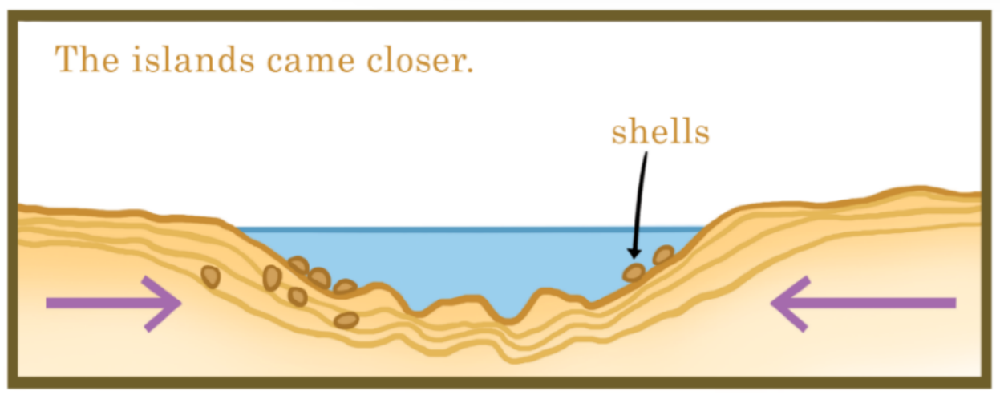
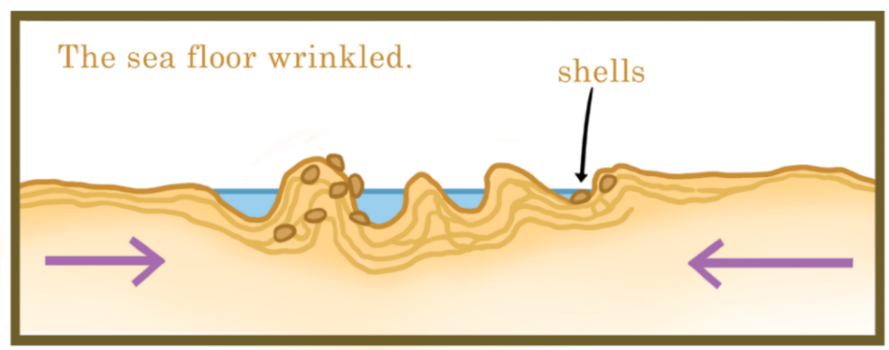

# How shells climb mountains
People find shells at the tops of high mountains. The tallest mountain in the world has shells near the top, inside the rocks. But shells are usually found on a beach, or in the sea! How did they get from the sea to a high mountain top? Did a wind blow them? Did people move them?

This is what happened, a long time ago. There were two islands close to each other in the sea. Shellfish lived on the bottom of the sea between the two islands. Over a long, long time, the islands came closer together.

Closer and closer they came, and the sea floor between them got squashed. It wrinkled, like bed sheets, or fallen-down socks. Some of the sea floor wrinkles went up, and some went down. The shellfish were carried up or down on the wrinkles as the islands moved toward each other.

As the islands moved even closer, the sea floor wrinkles got much higher above the sea. Finally, the islands joined together and formed one large, new land. Some of the shells from the sea floor were now at the top of tall mountains!