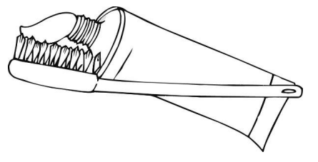

Do our teeth become cleaner and cleaner the longer and harder we brush them?

British researchers say no. They have actually tried out many different alternatives, and ended up with the perfect way to brush your teeth. A 2-minute brush, without brushing too hard, gives the best result. If you brush hard, you harm your tooth enamel and your gums without loosening food remnants or plaque.

Bente Hansen, an expert on tooth brushing, says that it is a good idea to hold the toothbrush the way you hold a pen. “Start in one corner and brush your way along the whole row,” she says. “Don’t forget your tongue either! It can actually contain loads of bacteria that may cause bad breath.”
