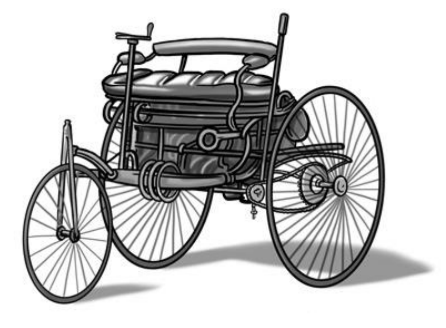

# THE FIRST CAR

A hundred and fifty years ago, motor cars did not exist, and—if they did not walk—people usually traveled in carts or wagons pulled by animals such as horses, oxen, or donkeys.

However, engineers and business people had started to think about building machines that used their own power source, such as oil, steam, or electricity. It's almost impossible to say who actually invented the car, since many inventors contributed their knowledge and ideas over many years, but the first vehicle that we recognize as a car was built in Germany in 1885 by Karl Benz. 

It looked like a small, horse-drawn carriage but was fueled by petrol. It travelled at what then seemed the tremendous speed of 16 kilometers per hour and was powered by a 0.75-horsepower, one-cylinder, four-stroke engine (about enough to pump water from a well to supply a few households).

It had three wire wheels, rather like those of a bicycle, not wooden ones used in carriages. Benz’s wife, Bertha Benz, was the first to drive it over a long distance, when she went on a 100-kilometer trip with her two sons to visit her mother. This pioneering trip demonstrated the value of the new vehicle for everyday travel by ordinary people.

The car has of course changed out of all recognition since that time, and become a normal mode of transport around the world.

# SOME SIGNIFICANT CARS IN HISTORY

| YEARS OF PRODUCTION   | NAME                           | NUMBER SOLD (APPROXIMATELY)   | MAXIMUM SPEED IN FIRST YEAR OF PRODUCTION   | COST IN FIRST YEAR OF PRODUCTION   |
|:----------------------|:-------------------------------|:------------------------------|:--------------------------------------------|:-----------------------------------|
| 1886–1889             | Karl Benz's horseless carriage | 25                            | 16 kilometers per hour                      | $1,000                             |
| 1908–1927             | Model T Ford                   | 17 million                    | 72 kilometers per hour                      | $825                               |
| 1938–2003             | Volkswagen Beetle              | 22 million                    | 100 kilometers per hour                     | $133                               |
| 1966–present          | Toyota Corolla                 | 40 million                    | 154 kilometers per hour                     | $1,830                             |
| 2005–present          | Bugatti-Veyron                 | 400                           | 409 kilometers per hour                     | $1 million                         |
